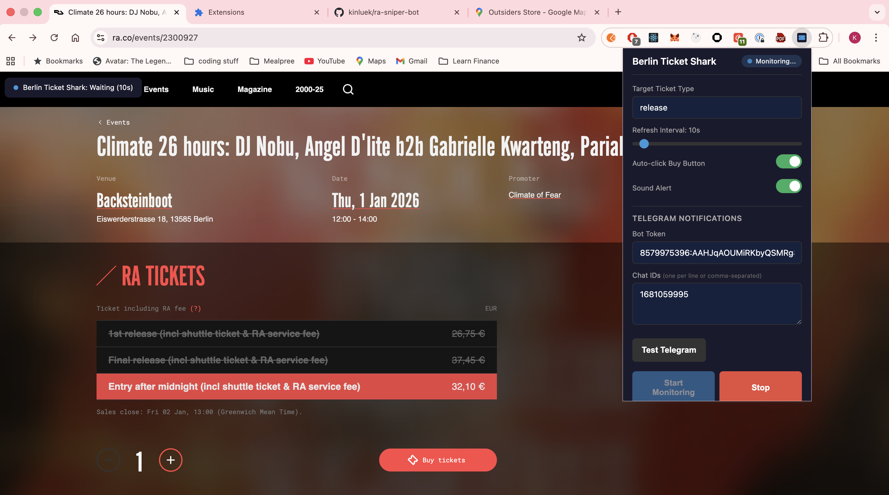

# Berlin Ticket Shark

A Chrome extension that monitors Resident Advisor (RA) event pages for ticket availability and alerts you instantly when sold-out tickets become available through resale.



## Features

- **Real-time Monitoring**: Automatically refreshes the RA event page at configurable intervals (5-120 seconds)
- **Smart Detection**: Detects when a specific ticket type becomes available using substring matching
- **Multi-Channel Alerts**:
  - Chrome desktop notifications
  - Audio alert sounds
  - Telegram notifications to your phone
- **Auto-Buy Option**: Automatically clicks the buy button when your target ticket appears
- **Remote Restart**: Reply "restart" to the Telegram bot to restart monitoring without touching your laptop
- **Visual Status Indicator**: Shows monitoring status directly on the RA page

---

## Installation

### Step 1: Download the Extension

Clone or download this repository to your local machine:

```bash
git clone <repository-url>
cd ra-bot
```

### Step 2: Load the Extension in Chrome

1. Open Chrome and navigate to `chrome://extensions`
2. Enable **Developer mode** (toggle in the top-right corner)
3. Click **Load unpacked**
4. Select the `extension` folder from this repository
5. The Berlin Ticket Shark extension should now appear in your extensions list

### Step 3: Pin the Extension (Recommended)

1. Click the puzzle piece icon in Chrome's toolbar
2. Find "Berlin Ticket Shark" and click the pin icon
3. The shark icon will now be visible in your toolbar for easy access

---

## Configuration

### Basic Settings

Click the Berlin Ticket Shark icon in your toolbar to open the settings popup:

| Setting | Description |
|---------|-------------|
| **Target Ticket Type** | The ticket name to watch for (uses substring matching, case-insensitive) |
| **Refresh Interval** | How often to refresh the page (5-120 seconds) |
| **Auto-Buy** | Automatically click the buy button when ticket is found |
| **Sound Alerts** | Play an audio beep pattern when ticket is found |

### Telegram Notifications (Recommended)

To receive alerts on your phone, set up Telegram notifications:

#### Step 1: Create a Telegram Bot

1. Open Telegram and search for **@BotFather**
2. Send `/newbot` and follow the prompts to create your bot
3. Copy the **API token** (looks like `123456789:ABCdefGHIjklMNOpqrsTUVwxyz`)

#### Step 2: Get Your Chat ID

1. Start a chat with your new bot (search for it and click "Start")
2. Send any message to the bot
3. Visit this URL in your browser (replace `YOUR_TOKEN` with your bot token):
   ```
   https://api.telegram.org/botYOUR_TOKEN/getUpdates
   ```
4. Find the `"chat":{"id":` value - this is your Chat ID (e.g., `123456789`)

#### Step 3: Configure in Extension

1. Open the Berlin Ticket Shark popup
2. Scroll to **Telegram Settings**
3. Enter your **Bot Token** and **Chat ID**
4. Click **Test Telegram** to verify it works
5. You should receive a test message on Telegram

---

## Usage

### Starting Monitoring

1. Navigate to the RA event page you want to monitor (e.g., `https://ra.co/events/2300927`)
2. Click the Berlin Ticket Shark icon in your toolbar
3. Enter the **Target Ticket Type** (e.g., "Early Bird" or "General Admission")
   - This uses substring matching, so "Early" will match "Early Bird Ticket"
   - Matching is case-insensitive
4. Adjust the refresh interval if needed
5. Toggle **Auto-Buy** if you want automatic purchasing
6. Click **Start Monitoring**

### Visual Indicator

When monitoring is active, you'll see a status indicator in the top-left corner of the RA page:

| Status | Color | Meaning |
|--------|-------|---------|
| Idle | Grey | Not monitoring |
| Starting... | Blue | Initializing |
| Waiting (Xs) | Blue | Waiting for next refresh |
| Checking... | Orange | Scanning ticket availability |
| TICKET FOUND! | Green | Target ticket is available! |
| Stopped | Grey | Monitoring stopped |

### When a Ticket is Found

1. **Chrome Notification**: A desktop notification appears (click to open the event page)
2. **Sound Alert**: An audio beep pattern plays (if enabled)
3. **Telegram Message**: You receive a message with ticket details and a link
4. **Auto-Buy**: If enabled, the extension attempts to select and purchase the ticket

### Stopping Monitoring

Click the Berlin Ticket Shark icon and click **Stop Monitoring**, or simply close the tab.

---

## Remote Restart via Telegram

After a ticket is found (or purchased with auto-buy), the extension listens for your commands via Telegram.

### How It Works

1. When monitoring completes, the extension starts polling Telegram every 30 seconds
2. Reply **restart** to your bot's notification message
3. The extension will:
   - Send a confirmation message
   - Navigate back to the event page
   - Restart monitoring with your previous settings

### Use Cases

- **Multi-ticket purchases**: Buy another ticket for a friend without touching your laptop
- **False positives**: If the ticket sold out before you could buy, restart and try again
- **Continuous monitoring**: Keep hunting for tickets throughout the day

---

## Running in the Background

### Screen Locked (Laptop Open)

The extension works perfectly when your screen is locked but laptop is open. To prevent your Mac from sleeping:

```bash
# Run this in Terminal to prevent idle sleep
caffeinate -is &
```

To stop:
```bash
pkill caffeinate
```

### Different Browser Window/Space

The extension works at full speed when the RA tab is in:
- A separate browser window
- A different macOS Space (full-screen app on another desktop)
- Behind other windows

**Note**: If the tab is minimized to the Dock, Chrome may throttle timers to ~1 minute intervals.

### Laptop Lid Closed

Unfortunately, closing the laptop lid triggers hardware sleep, which suspends all processes including Chrome. Options:

1. **Keep laptop open** with screen dimmed
2. **Clamshell mode** with external display + power adapter
3. **Disable lid sleep** (advanced):
   ```bash
   sudo pmset -b disablesleep 1  # Enable
   sudo pmset -b disablesleep 0  # Disable later
   ```

---

## Troubleshooting

### Extension Not Detecting Tickets

1. **Check the target ticket name**: Open the RA page and note the exact ticket name
2. **Use a shorter substring**: Instead of "Early Bird Ticket €25", just use "Early Bird"
3. **Check the console**: Right-click the RA page → Inspect → Console, look for `[Berlin Ticket Shark]` logs

### Telegram Notifications Not Working

1. **Verify bot token**: Make sure there are no extra spaces
2. **Check chat ID**: Ensure you've messaged your bot at least once before getting the chat ID
3. **Test connection**: Use the "Test Telegram" button in the popup
4. **Check bot privacy**: If using in a group, you may need to disable privacy mode via @BotFather

### Restart Command Not Working

1. **Check Service Worker logs**: Go to `chrome://extensions` → Berlin Ticket Shark → "Service Worker" link
2. **Verify polling is active**: Look for `⏰ Alarm triggered: telegram-poll` logs
3. **Check chat ID match**: The logs show which chat IDs are authorized
4. **Reply correctly**: Send exactly `restart` (case-insensitive, no extra characters)

### Extension Stops Working After a While

Chrome service workers can go to sleep, but alarms should wake them up. If issues persist:

1. Reload the extension at `chrome://extensions`
2. Check if Chrome itself is being suspended (use `caffeinate`)

---

## Viewing Logs

| Log Type | How to View |
|----------|-------------|
| Background/Polling | `chrome://extensions` → Berlin Ticket Shark → "Service Worker" |
| Page Monitoring | Right-click RA page → Inspect → Console |
| Popup | Right-click extension icon → "Inspect popup" |

---

## File Structure

```
extension/
├── manifest.json      # Extension configuration
├── background.js      # Service worker (notifications, Telegram polling)
├── content.js         # Page monitoring logic
├── payment.js         # Payment page handling
├── popup.html         # Settings UI
├── popup.js           # Settings logic
├── styles.css         # Dark theme styling
├── icons/             # Extension icons
│   ├── icon16.png
│   ├── icon48.png
│   └── icon128.png
└── generate-icons.html # Utility to regenerate icons
```

---

## Privacy & Security

- **No data collection**: All settings are stored locally in Chrome's sync storage
- **No external servers**: The extension only communicates with RA (for monitoring) and Telegram (for notifications)
- **Your Telegram token**: Stored locally and only used to send you notifications

---

## Disclaimer

This extension is for personal use only! Don't be a shark!
